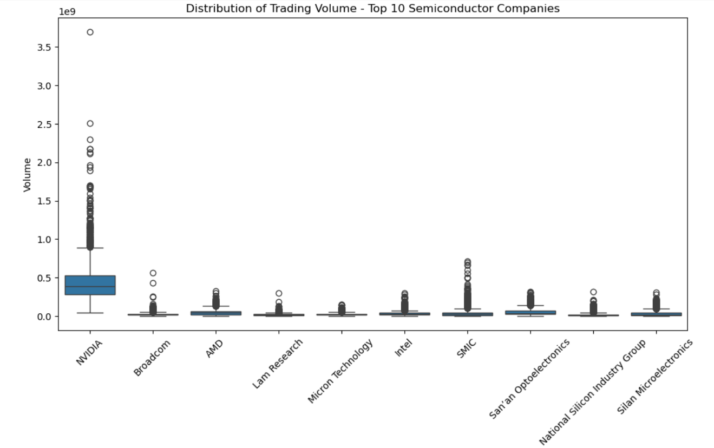

# Stock Price Prediction

## Dataset
The dataset contains historical stock prices and trading volumes for multiple companies over several years.  
It includes the following columns:  

- **date** – trading date  
- **company_name** – name of the company  
- **stock_name** – stock name of the company  
- **open** – opening price  
- **high** – highest price of the day  
- **low** – lowest price of the day  
- **close** – closing price  
- **volume** – number of shares traded  

We analyze this dataset using **matplotlib** and **seaborn** to explore patterns and trends in stock growth across companies.  
The processed data is then used to train machine learning models for **time-series forecasting** of stock prices.

## Exploratory Data Analysis  

We performed EDA to better understand the trends and patterns in the semiconductor stock dataset. Below are some key visualizations:

### 1. Closing Price Trends (Top 6 Companies)  
This chart shows the **closing prices** of the top 6 semiconductor companies. NVIDIA exhibits strong exponential growth compared to others.  

---

### 2. Trading Volume Trends (Top 5 Companies)  
Here we observe the **trading volumes**. NVIDIA dominates with consistently higher volumes, while other companies show relatively stable trading activity.  

---

### 3. Distribution of Trading Volume (Top 10 Companies)  
A boxplot visualization of the **trading volume distribution**. NVIDIA again shows the highest variance and outliers, suggesting strong market activity.  

---

### 4. Correlation of Closing Prices Between Companies  
The heatmap below shows the **correlation matrix** of closing prices among semiconductor companies.  
- Strong positive correlations are seen between **AMD, Lam Research, NVIDIA, and Broadcom**, suggesting they move closely together.  
- Intel, however, shows weaker correlations with others, indicating different price dynamics.  
- Industry Group has negative correlations with many companies, behaving differently from the rest of the sector.  

## Data Preprocessing  

The dataset was prepared for modeling through the following steps:

### 1. Company-wise Processing
- The dataset was split by `company_name` so that each company was processed independently.  
- Within each company, records were sorted chronologically by `date`.  

### 2. Train/Test Split
- Each company’s data was divided into **80% training** and **20% testing**.  
- The split was performed **before scaling** to prevent data leakage.  

### 3. Scaling
- `MinMaxScaler` was applied to normalize both:
  - Features → `high`, `low`, `open`, `volume`  
  - Target → `close`  
- Each company was assigned its own pair of scalers, stored in a dictionary for later inverse transformation.  

### 4. Sequence Generation
- A **sliding window** of `SEQ_LEN = 60` days was used.  
- For every 60-day sequence:
  - `X_num_company` → scaled features  
  - `X_comp_company` → company identifier (for embedding layers)  
  - `y_company` → next-day closing price (scaled)  

---

## Modeling  

A multi-company stock prediction model was constructed using:
- Numerical features (`high`, `low`, `open`, `volume`)  
- Company embeddings (`company_name` encoded as integers)  
- Bidirectional GRU layers with an attention mechanism  

The model was trained to predict the next-day closing price.

---

## Results  

- Most companies achieved **R² > 0.95**, indicating strong predictive performance.  
- NVIDIA, however, exhibited significantly weaker results, with predictions failing to align with actual price movements.  

---

## Why NVIDIA is Different  

1. **Exponential Growth** – NVIDIA’s stock price exhibited rapid post-2020 growth, which differs from the more gradual patterns of other semiconductor companies.  
2. **Scaling Limitations** – The use of `MinMaxScaler` compressed extreme values, making NVIDIA’s surge difficult for the model to capture.  
3. **Distribution Shift** – NVIDIA displayed higher variance and volatility compared to peers, causing the shared multi-company model to underfit its dynamics.  

---

## NVIDIA-Specific Model 

Since NVIDIA behaved very differently compared to other companies, I also trained a **dedicated LSTM model** using only NVIDIA’s historical data.  
This avoids the averaging effect of the multi-company model and focuses solely on NVIDIA’s unique growth pattern.

### Results (Test Set)

| Model                   | R² Score | MSE       | MAE      |
|-------------------------|----------|-----------|----------|
| Multi-Company Model     |  -0.3574 | 2963.2740 | 39.3133  |
| NVIDIA-Only LSTM Model  |   0.712  | 626.74    | 17.289   |

### Takeaway
- The **multi-company model** captures general semiconductor trends but struggles with NVIDIA’s explosive growth.  
- The **NVIDIA-only model** fits much better, achieving significantly higher accuracy.  
- For production:
  - Use the **multi-company model** for sector-wide predictions.  
  - Use the **NVIDIA-only model** when focusing specifically on NVIDIA.  

---

## Future Work 

While the current models demonstrate strong predictive performance, there are several directions to further improve this project:

1. **Feature Engineering**  
   - Incorporate additional features such as technical indicators (e.g., RSI, MACD, Bollinger Bands).  
   - Add macroeconomic indicators (e.g., interest rates, inflation, market indices).  

2. **Advanced Architectures**  
   - Experiment with **Transformers** for long-term dependencies.  
   - Use **hybrid CNN-LSTM models** to capture both local patterns and long-term trends.  

3. **Handling Volatility**  
   - Apply techniques for volatility modeling to better capture sudden price swings.  
   - Try regime-switching models to account for bull vs. bear market phases.  

## Author 

- **Ishan Khan** 
